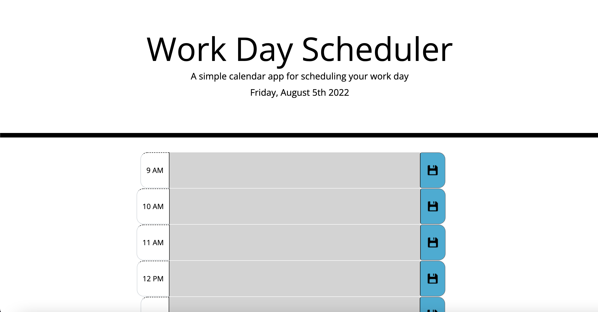

# work-day-planner

# Description
In this challenge we wanted to create a work day planner that let you write events and save them. We used HTML, CSS, Javascript and some 3rd party APIs like bootstrap and jQuery to accomplish this. Write in the textbox next to the correspoding hour you would the event scheduled. When you reload the page the events will disappear if you would like to keep your events saved, you should select the blue save button to the right of the text box.

# ScreenShoot

This is what the program should look like :

# Link

Open this link in your browser to use the password Generator: [Workday Planner](https://cooper2016.github.io/work-day-planner/)